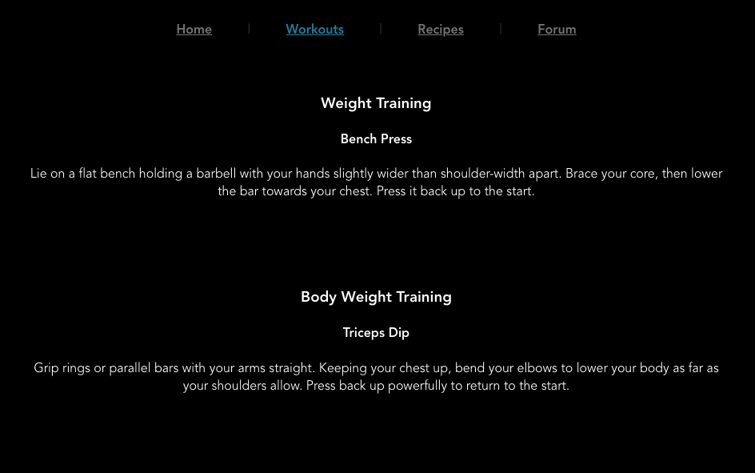
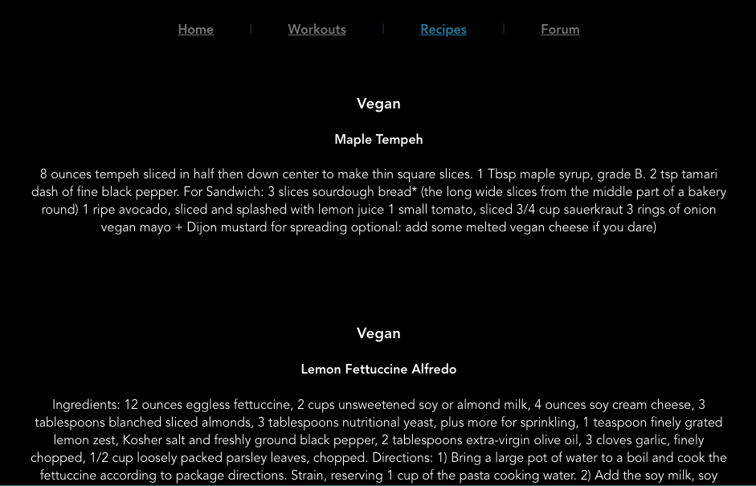
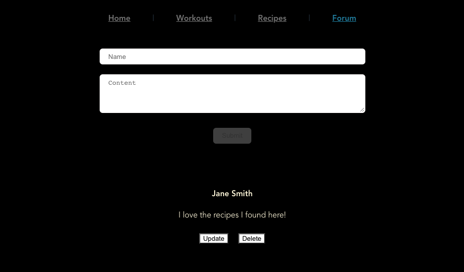

# lifestyle

## Date: 10/18/2021

#### By: Jin Yang Brancalhao

[Git](https://github.com/jinyangb/lifestyle) | [Trello](https://trello.com/b/RgjNNQgU/lifestyle) | [Lifestyle]()

---

**_Description_**

A lifestyle based app where you can find common workout and instructions on how to do them. You can also find recipes for vegan, vegetarian, and for non restricted diet. Additionally you can share your experiences of what your favorite food, recipe or exercise routine is.

---

**_Technologies Used_**

- Postgresql
- Express
- Heroku
- VUE
- Sequelize

#### Workout Page

#### Recipe Page

#### Forum Page

---

**_Getting Started_**

Click the Heroku link at the top of the readme. Once you are redirected you can find instructions on workouts and recipes as well as discuss your experiences.

---

**_Future Updates_**

- [ ] Auth
- [ ] Catergorize recipes and workouts

---

**_Credits_**

[Google](google.com)

[Healthline](https://www.healthline.com/health/how-long-does-it-take-to-build-muscle#diet)

[Coachmag](https://www.coachmag.co.uk/full-body-workouts/6179/a-four-week-gym-routine-to-get-big-and-lean)

[Delicious](https://www.delicious.com.au/recipes/collections/gallery/74-healthy-high-protein-recipes/hdpxdv1y)
